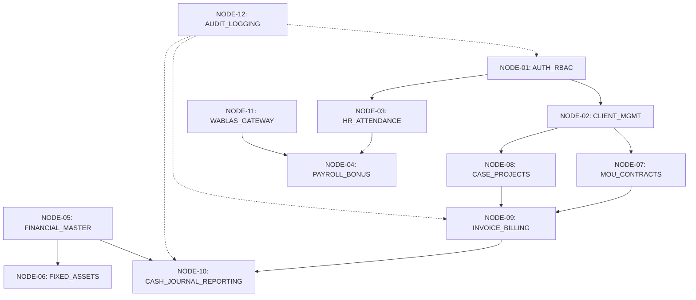

# Pemetaan Node Fitur & Arsitektur Rafatax (v1)

Dokumen ini berisi pemetaan lengkap **Node Fitur (Feature Nodes)** dari sistem Rafatax v1. Pemetaan ini dirancang agar AI agent dan pengembang dapat dengan cepat memahami struktur aplikasi, hubungan antar komponen, lokasi file terkait, serta panduan langkah demi langkah (*recipe*) untuk menambahkan fitur baru secara efisien.

---

## 1. Ikhtisar Arsitektur Sistem

- **Framework**: Laravel (PHP 8.2+) dengan Filament PHP v3.
- **Dual Panel Architecture**:
  - **Admin Panel** (`/admin`): Menggunakan Provider [`AdminPanelProvider.php`](file:///d:/laragon/www/rafatax-v1/app/Providers/Filament/AdminPanelProvider.php). Akses penuh pengelolaan master data, penggalangan dana, payroll, jurnal, dan laporan keuangan.
  - **App Panel** (`/app`): Menggunakan Provider [`AppPanelProvider.php`](file:///d:/laragon/www/rafatax-v1/app/Providers/Filament/AppPanelProvider.php). Panel operasional/klien dengan scope dan tampilan terpisah.
- **Sistem Otentikasi & Otorisasi**:
  - Trait [`HasPermissions.php`](file:///d:/laragon/www/rafatax-v1/app/Traits/HasPermissions.php) pada model `User`.
  - Berbasis Role & Permission kustom (`Role`, `Permission`, `RolePermission`, `RoleUser`).
- **Integrasi Eksternal**:
  - **Wablas Gateway**: Layanan pengiriman WhatsApp broadcast & PDF slip gaji ([`WablasService.php`](file:///d:/laragon/www/rafatax-v1/app/Services/WablasService.php)).
  - **KPI API Service**: Integrasi sistem penilaian kinerja ([`KpiApiService.php`](file:///d:/laragon/www/rafatax-v1/app/Services/KpiApiService.php)).

---

## 2. Diagram Diagram Node Utama (Feature Node Tree)



---

## 3. Detail Rincian 12 Node Fitur

### NODE-01: AUTH_RBAC (Akses & Otentikasi)
* **Deskripsi**: Mengelola pengguna, hak akses, role, serta integrasi otentikasi dual-panel (`/admin` dan `/app`).
* **Model**: [`User.php`](file:///d:/laragon/www/rafatax-v1/app/Models/User.php), [`Role.php`](file:///d:/laragon/www/rafatax-v1/app/Models/Role.php), [`Permission.php`](file:///d:/laragon/www/rafatax-v1/app/Models/Permission.php), [`RolePermission.php`](file:///d:/laragon/www/rafatax-v1/app/Models/RolePermission.php), [`RoleUser.php`](file:///d:/laragon/www/rafatax-v1/app/Models/RoleUser.php)
* **Trait**: [`HasPermissions.php`](file:///d:/laragon/www/rafatax-v1/app/Traits/HasPermissions.php)
* **Filament Resources**:
  - Admin: [`UserResource.php`](file:///d:/laragon/www/rafatax-v1/app/Filament/Resources/UserResource.php), [`RoleResource.php`](file:///d:/laragon/www/rafatax-v1/app/Filament/Resources/RoleResource.php), [`PermissionResource.php`](file:///d:/laragon/www/rafatax-v1/app/Filament/Resources/PermissionResource.php)
* **Dokumentasi Terkait**: [`PERMISSION_SYSTEM.md`](file:///d:/laragon/www/rafatax-v1/PERMISSION_SYSTEM.md), [`CARA_PENGGUNAAN_PERMISSION.md`](file:///d:/laragon/www/rafatax-v1/CARA_PENGGUNAAN_PERMISSION.md)

---

### NODE-02: CLIENT_MGMT (Manajemen Klien)
* **Deskripsi**: Pengelolaan data master Klien (Wajib Pajak/Perusahaan), pelaporan klien, dan API khusus klien.
* **Model**: [`Client.php`](file:///d:/laragon/www/rafatax-v1/app/Models/Client.php), [`ClientReport.php`](file:///d:/laragon/www/rafatax-v1/app/Models/ClientReport.php)
* **Filament Resources**:
  - Admin: [`ClientResource.php`](file:///d:/laragon/www/rafatax-v1/app/Filament/Resources/ClientResource.php), [`ClientReportResource.php`](file:///d:/laragon/www/rafatax-v1/app/Filament/Resources/ClientReportResource.php)
  - App: [`ClientResource.php`](file:///d:/laragon/www/rafatax-v1/app/Filament/App/Resources/ClientResource.php)
* **API & Controllers**: [`API/ClientController.php`](file:///d:/laragon/www/rafatax-v1/app/Http/Controllers/API/ClientController.php), [`API/AuthController.php`](file:///d:/laragon/www/rafatax-v1/app/Http/Controllers/API/AuthController.php)
* **Dokumentasi Terkait**: [`CLIENT_API_DOCUMENTATION.md`](file:///d:/laragon/www/rafatax-v1/CLIENT_API_DOCUMENTATION.md)

---

### NODE-03: HR_ATTENDANCE (Kepegawaian, Presensi & Kompetensi)
* **Deskripsi**: Data pegawai/staff, presensi bulanan/harian, kompetensi, pelatihan, referensi jabatan/departemen, dan integrasi API KPI.
* **Model**: [`Staff.php`](file:///d:/laragon/www/rafatax-v1/app/Models/Staff.php), [`StaffAttendance.php`](file:///d:/laragon/www/rafatax-v1/app/Models/StaffAttendance.php), [`StaffCompetency.php`](file:///d:/laragon/www/rafatax-v1/app/Models/StaffCompetency.php), [`Training.php`](file:///d:/laragon/www/rafatax-v1/app/Models/Training.php), [`DepartmentReference.php`](file:///d:/laragon/www/rafatax-v1/app/Models/DepartmentReference.php), [`PositionReference.php`](file:///d:/laragon/www/rafatax-v1/app/Models/PositionReference.php), [`PerformanceReviewReference.php`](file:///d:/laragon/www/rafatax-v1/app/Models/PerformanceReviewReference.php)
* **Service**: [`KpiApiService.php`](file:///d:/laragon/www/rafatax-v1/app/Services/KpiApiService.php)
* **Filament Resources**:
  - Admin: [`StaffResource.php`](file:///d:/laragon/www/rafatax-v1/app/Filament/Resources/StaffResource.php), [`StaffAttendanceResource.php`](file:///d:/laragon/www/rafatax-v1/app/Filament/Resources/StaffAttendanceResource.php), [`StaffCompetencyResource.php`](file:///d:/laragon/www/rafatax-v1/app/Filament/Resources/StaffCompetencyResource.php), [`TrainingResource.php`](file:///d:/laragon/www/rafatax-v1/app/Filament/Resources/TrainingResource.php), [`DepartmentReferenceResource.php`](file:///d:/laragon/www/rafatax-v1/app/Filament/Resources/DepartmentReferenceResource.php), [`PositionReferenceResource.php`](file:///d:/laragon/www/rafatax-v1/app/Filament/Resources/PositionReferenceResource.php)
* **Controllers & Export**: [`ExportAttendanceController.php`](file:///d:/laragon/www/rafatax-v1/app/Http/Controllers/ExportAttendanceController.php), [`API/StaffController.php`](file:///d:/laragon/www/rafatax-v1/app/Http/Controllers/API/StaffController.php)

---

### NODE-04: PAYROLL_BONUS (Penggajian & Insentif)
* **Deskripsi**: Perhitungan gaji bulanan staff, rincian komponen gaji, slip gaji PDF, insentif/bonus, rekapitulasi, dan pengiriman otomatis via WhatsApp.
* **Model**: [`Payroll.php`](file:///d:/laragon/www/rafatax-v1/app/Models/Payroll.php), [`PayrollDetail.php`](file:///d:/laragon/www/rafatax-v1/app/Models/PayrollDetail.php), [`PayrollBonus.php`](file:///d:/laragon/www/rafatax-v1/app/Models/PayrollBonus.php), [`PayrollBonusDetail.php`](file:///d:/laragon/www/rafatax-v1/app/Models/PayrollBonusDetail.php)
* **Filament Resources & Pages**:
  - Admin: [`PayrollResource.php`](file:///d:/laragon/www/rafatax-v1/app/Filament/Resources/PayrollResource.php), [`PayrollDetailResource.php`](file:///d:/laragon/www/rafatax-v1/app/Filament/Resources/PayrollDetailResource.php), [`PayrollBonusResource.php`](file:///d:/laragon/www/rafatax-v1/app/Filament/Resources/PayrollBonusResource.php), [`RekapPayroll.php`](file:///d:/laragon/www/rafatax-v1/app/Filament/Pages/RekapPayroll.php)
* **Jobs & Commands**: [`SendPayslipPdf.php`](file:///d:/laragon/www/rafatax-v1/app/Jobs/SendPayslipPdf.php), [`CleanupOldPayslips.php`](file:///d:/laragon/www/rafatax-v1/app/Console/Commands/CleanupOldPayslips.php)
* **Controllers**: [`ExportPayrollController.php`](file:///d:/laragon/www/rafatax-v1/app/Http/Controllers/ExportPayrollController.php), [`PayrollBonusExportController.php`](file:///d:/laragon/www/rafatax-v1/app/Http/Controllers/PayrollBonusExportController.php), [`PayrollWhatsAppController.php`](file:///d:/laragon/www/rafatax-v1/app/Http/Controllers/PayrollWhatsAppController.php)

---

### NODE-05: FINANCIAL_MASTER (Master Keuangan & COA)
* **Deskripsi**: Bagan akun standar (Chart of Accounts / COA), grup akun, referensi buku kas/jurnal, dan saldo awal piutang.
* **Model**: [`Coa.php`](file:///d:/laragon/www/rafatax-v1/app/Models/Coa.php), [`GroupCoa.php`](file:///d:/laragon/www/rafatax-v1/app/Models/GroupCoa.php), [`CashReference.php`](file:///d:/laragon/www/rafatax-v1/app/Models/CashReference.php), [`JournalBookReference.php`](file:///d:/laragon/www/rafatax-v1/app/Models/JournalBookReference.php), [`SaldoAwalPiutang.php`](file:///d:/laragon/www/rafatax-v1/app/Models/SaldoAwalPiutang.php)
* **Filament Resources**:
  - Admin: [`CoaResource.php`](file:///d:/laragon/www/rafatax-v1/app/Filament/Resources/CoaResource.php), [`GroupCoaResource.php`](file:///d:/laragon/www/rafatax-v1/app/Filament/Resources/GroupCoaResource.php), [`CashReferenceResource.php`](file:///d:/laragon/www/rafatax-v1/app/Filament/Resources/CashReferenceResource.php), [`JournalBookReferenceResource.php`](file:///d:/laragon/www/rafatax-v1/app/Filament/Resources/JournalBookReferenceResource.php), [`SaldoAwalPiutangResource.php`](file:///d:/laragon/www/rafatax-v1/app/Filament/Resources/SaldoAwalPiutangResource.php)
* **Controllers**: [`CashReferenceMonthController.php`](file:///d:/laragon/www/rafatax-v1/app/Http/Controllers/CashReferenceMonthController.php), [`CashReferenceMonthDetailController.php`](file:///d:/laragon/www/rafatax-v1/app/Http/Controllers/CashReferenceMonthDetailController.php)

---

### NODE-06: FIXED_ASSETS (Aktiva Tetap & Depresiasi)
* **Deskripsi**: Pengelolaan daftar aktiva tetap perusahan/klien, metode dan jadwal kalkulasi depresiasi bulanan otomatis.
* **Model**: [`DaftarAktivaTetap.php`](file:///d:/laragon/www/rafatax-v1/app/Models/DaftarAktivaTetap.php), [`DepresiasiAktivaTetap.php`](file:///d:/laragon/www/rafatax-v1/app/Models/DepresiasiAktivaTetap.php)
* **Service**: [`DepreciationService.php`](file:///d:/laragon/www/rafatax-v1/app/Services/DepreciationService.php)
* **Console Command**: [`GenerateMonthlyDepreciation.php`](file:///d:/laragon/www/rafatax-v1/app/Console/Commands/GenerateMonthlyDepreciation.php) (Scheduler akhir bulan)
* **Filament Resources**:
  - Admin: [`DaftarAktivaTetapResource.php`](file:///d:/laragon/www/rafatax-v1/app/Filament/Resources/DaftarAktivaTetapResource.php), [`DepresiasiAktivaTetapResource.php`](file:///d:/laragon/www/rafatax-v1/app/Filament/Resources/DepresiasiAktivaTetapResource.php)
* **Controllers**: [`DaftarAktivaExportController.php`](file:///d:/laragon/www/rafatax-v1/app/Http/Controllers/DaftarAktivaExportController.php)

---

### NODE-07: MOU_CONTRACTS (Kontrak & Perjanjian Kerjasama)
* **Deskripsi**: Kontrak layanan konsultan pajak (MoU), daftar biaya jasa, checklist kelengkapan berkas/bukti potong, dan MoU Piutang Lama.
* **Model**: [`MoU.php`](file:///d:/laragon/www/rafatax-v1/app/Models/MoU.php), [`CategoryMou.php`](file:///d:/laragon/www/rafatax-v1/app/Models/CategoryMou.php), [`ChecklistMou.php`](file:///d:/laragon/www/rafatax-v1/app/Models/ChecklistMou.php), [`CostListMou.php`](file:///d:/laragon/www/rafatax-v1/app/Models/CostListMou.php)
* **Filament Resources & Pages**:
  - Admin: [`MouResource.php`](file:///d:/laragon/www/rafatax-v1/app/Filament/Resources/MouResource.php), [`MouPiutangLamaResource.php`](file:///d:/laragon/www/rafatax-v1/app/Filament/Resources/MouPiutangLamaResource.php), [`CategoryMouResource.php`](file:///d:/laragon/www/rafatax-v1/app/Filament/Resources/CategoryMouResource.php), [`ChecklistMouResource.php`](file:///d:/laragon/www/rafatax-v1/app/Filament/Resources/ChecklistMouResource.php), [`MonitoringChecklist.php`](file:///d:/laragon/www/rafatax-v1/app/Filament/Pages/MonitoringChecklist.php), [`ChecklistBuktiPotong.php`](file:///d:/laragon/www/rafatax-v1/app/Filament/Pages/ChecklistBuktiPotong.php)
* **Controllers**: [`MouPrintViewController.php`](file:///d:/laragon/www/rafatax-v1/app/Http/Controllers/MouPrintViewController.php)

---

### NODE-08: CASE_PROJECTS (Penanganan Kasus & Project Tax)
* **Deskripsi**: Pengelolaan penanganan kasus perpajakan spesifik per klien (Pemeriksaan, Keberatan, Banding) beserta detail tahapan/progress.
* **Model**: [`CaseProject.php`](file:///d:/laragon/www/rafatax-v1/app/Models/CaseProject.php), [`CaseProjectDetail.php`](file:///d:/laragon/www/rafatax-v1/app/Models/CaseProjectDetail.php)
* **Filament Resources & Pages**:
  - Admin: [`CaseProjectResource.php`](file:///d:/laragon/www/rafatax-v1/app/Filament/Resources/CaseProjectResource.php), [`CaseProjectDetailResource.php`](file:///d:/laragon/www/rafatax-v1/app/Filament/Resources/CaseProjectDetailResource.php), [`RekapInvoiceKasus.php`](file:///d:/laragon/www/rafatax-v1/app/Filament/Pages/RekapInvoiceKasus.php)

---

### NODE-09: INVOICE_BILLING (Penagihan & Invoice)
* **Deskripsi**: Pembuatan invoice penagihan berbasis MoU/Kasus, rincian invoice, memo penagihan, pemantauan tanggal jatuh tempo, dan cetak PDF/JPG invoice.
* **Model**: [`Invoice.php`](file:///d:/laragon/www/rafatax-v1/app/Models/Invoice.php), [`CostListInvoice.php`](file:///d:/laragon/www/rafatax-v1/app/Models/CostListInvoice.php), [`Memo.php`](file:///d:/laragon/www/rafatax-v1/app/Models/Memo.php)
* **Filament Resources & Pages**:
  - Admin: [`InvoiceResource.php`](file:///d:/laragon/www/rafatax-v1/app/Filament/Resources/InvoiceResource.php), [`MemoResource.php`](file:///d:/laragon/www/rafatax-v1/app/Filament/Resources/MemoResource.php), [`RekapInvoice.php`](file:///d:/laragon/www/rafatax-v1/app/Filament/Pages/RekapInvoice.php), [`RekapInvoiceMonthly.php`](file:///d:/laragon/www/rafatax-v1/app/Filament/Pages/RekapInvoiceMonthly.php), [`RekapInvoiceTahunan.php`](file:///d:/laragon/www/rafatax-v1/app/Filament/Pages/RekapInvoiceTahunan.php)
* **Console Command**: [`UpdateOverdueInvoices.php`](file:///d:/laragon/www/rafatax-v1/app/Console/Commands/UpdateOverdueInvoices.php)
* **Controllers**: [`InvoicePrintController.php`](file:///d:/laragon/www/rafatax-v1/app/Http/Controllers/InvoicePrintController.php), [`MemoPrintController.php`](file:///d:/laragon/www/rafatax-v1/app/Http/Controllers/MemoPrintController.php)

---

### NODE-10: CASH_JOURNAL_REPORTING (Buku Kas & Laporan Keuangan)
* **Deskripsi**: Transaksi Kas/Bank, Jurnal Umum, Laporan Laba Rugi, Neraca, Neraca Lajur Bulanan, serta laporan piutang per klien.
* **Model**: [`CashReport.php`](file:///d:/laragon/www/rafatax-v1/app/Models/CashReport.php), [`JournalBookReport.php`](file:///d:/laragon/www/rafatax-v1/app/Models/JournalBookReport.php)
* **Services**: [`LabaRugiReportService.php`](file:///d:/laragon/www/rafatax-v1/app/Services/LabaRugiReportService.php), [`NeracaReportService.php`](file:///d:/laragon/www/rafatax-v1/app/Services/NeracaReportService.php)
* **Filament Pages**:
  - Admin: [`RekapLaporanKeuangan.php`](file:///d:/laragon/www/rafatax-v1/app/Filament/Pages/RekapLaporanKeuangan.php), [`PiutangPerClient.php`](file:///d:/laragon/www/rafatax-v1/app/Filament/Pages/PiutangPerClient.php)
  - App: [`LabaRugi.php`](file:///d:/laragon/www/rafatax-v1/app/Filament/App/Pages/LabaRugi.php), [`Neraca.php`](file:///d:/laragon/www/rafatax-v1/app/Filament/App/Pages/Neraca.php), [`NeracaLajurBulanan.php`](file:///d:/laragon/www/rafatax-v1/app/Filament/App/Pages/NeracaLajurBulanan.php)
* **Controllers & Exporters**: [`NeracaController.php`](file:///d:/laragon/www/rafatax-v1/app/Http/Controllers/NeracaController.php), [`NeracaLajurController.php`](file:///d:/laragon/www/rafatax-v1/app/Http/Controllers/NeracaLajurController.php), [`NeracaLajurPiutangController.php`](file:///d:/laragon/www/rafatax-v1/app/Http/Controllers/NeracaLajurPiutangController.php), [`PiutangDetailController.php`](file:///d:/laragon/www/rafatax-v1/app/Http/Controllers/PiutangDetailController.php), [`RekapPaymentExporter.php`](file:///d:/laragon/www/rafatax-v1/app/Helpers/RekapPaymentExporter.php)

---

### NODE-11: WATSAPP_GATEWAYS (Integrasi WhatsApp Gateway & Wablas)
* **Deskripsi**: Modul pengiriman pesan dan dokumen PDF otomatis via Wablas WhatsApp API dan **WhatsApp Gateway** (go-whatsapp-web-multidevice v9.0.0), halaman setting khusus Admin Panel, broadcast massa, dan pengujian koneksi.
* **Services**: [`WablasService.php`](file:///d:/laragon/www/rafatax-v1/app/Services/WablasService.php), [`WhatsAppGatewayService.php`](file:///d:/laragon/www/rafatax-v1/app/Services/WhatsAppGatewayService.php)
* **Filament Pages**: [`WhatsappBroadcast.php`](file:///d:/laragon/www/rafatax-v1/app/Filament/Pages/WhatsappBroadcast.php), [`WhatsAppGatewaySettings.php`](file:///d:/laragon/www/rafatax-v1/app/Filament/Pages/WhatsAppGatewaySettings.php) (Khusus Admin Panel)
* **Console Commands**: [`TestWablasConnection.php`](file:///d:/laragon/www/rafatax-v1/app/Console/Commands/TestWablasConnection.php), [`TestWhatsAppGateway.php`](file:///d:/laragon/www/rafatax-v1/app/Console/Commands/TestWhatsAppGateway.php)
* **Dokumentasi Terkait**: `WABLAS_DOCUMENT_ISSUE.md`, `WABLAS_FIX_DOCUMENTATION.md`

---

### NODE-12: AUDIT_LOGGING (Log Aktivitas & Audit Trail)
* **Deskripsi**: Pencatatan aktivitas user (create, update, delete, login, export) secara menyeluruh untuk transparansi dan audit trail.
* **Model**: [`ActivityLog.php`](file:///d:/laragon/www/rafatax-v1/app/Models/ActivityLog.php)
* **Trait**: [`LogsActivity.php`](file:///d:/laragon/www/rafatax-v1/app/Traits/LogsActivity.php)
* **Filament Resources**: [`ActivityLogResource.php`](file:///d:/laragon/www/rafatax-v1/app/Filament/Resources/ActivityLogResource.php)
* **Controllers**: [`ActivityLogController.php`](file:///d:/laragon/www/rafatax-v1/app/Http/Controllers/ActivityLogController.php)

---

## 4. Panduan Eksekusi (Recipe Blueprint) Saat Menambah Fitur Baru

Untuk memastikan penambahan fitur berjalan cepat, konsisten, dan bebas error, ikuti pola checklist berikut:

```
┌─────────────────────────────────────────────────────────────┐
│ LANGKAH 1: Database & Model (Migration, Schema, Trait)      │
├─────────────────────────────────────────────────────────────┤
│ LANGKAH 2: Service Layer & Business Logic                   │
├─────────────────────────────────────────────────────────────┤
│ LANGKAH 3: Otorisasi & Permission Registration               │
├─────────────────────────────────────────────────────────────┤
│ LANGKAH 4: Filament Resource / Page (Admin & App Panel)     │
├─────────────────────────────────────────────────────────────┤
│ LANGKAH 5: Route, Export / Print Controller (Jika Perlu)    │
├─────────────────────────────────────────────────────────────┤
│ LANGKAH 6: Background Task / Cron Command (Jika Perlu)      │
└─────────────────────────────────────────────────────────────┘
```

### Checklist Langkah per Langkah:

1. **Database Migration & Model (`app/Models`)**
   - Buat migration: `php artisan make:migration create_nama_tabel_table`
   - Buat Model di [`app/Models`](file:///d:/laragon/www/rafatax-v1/app/Models):
     - Tambahkan `$fillable` atau `$guarded`.
     - Gunakan trait [`LogsActivity.php`](file:///d:/laragon/www/rafatax-v1/app/Traits/LogsActivity.php) jika membutuhkan audit log.
     - Definisikan relasi Eloquent (`belongsTo`, `hasMany`, dll).

2. **Service Layer (`app/Services`)**
   - Jika fitur melibatkan kalkulasi kompleks (seperti Neraca/Depresiasi/Wablas), buat/perbarui Service di [`app/Services`](file:///d:/laragon/www/rafatax-v1/app/Services).
   - Hindari meletakkan query / kalkulasi rumit di Controller atau Filament Resource.

3. **Registrasi Permission (`NODE-01`)**
   - Tambahkan permission baru di sistem sesuai konvensi permission project (lihat [`PERMISSION_SYSTEM.md`](file:///d:/laragon/www/rafatax-v1/PERMISSION_SYSTEM.md)).
   - Assign permission ke Role terkait.

4. **Filament Resource & Page (`app/Filament`)**
   - Jalankan `php artisan make:filament-resource NamaFiturResource`
   - Sesuaikan `form()`, `table()`, `infolist()`, dan `getRelations()`.
   - Jika fitur butuh tampilan tersendiri/dashboard khusus, gunakan `php artisan make:filament-page NamaHalaman`.
   - Jika perlu diakses dari App Panel, daftarkan juga di [`app/Filament/App`](file:///d:/laragon/www/rafatax-v1/app/Filament/App).

5. **Routes & Export Controller (`routes/web.php` / `app/Http/Controllers`)**
   - Jika fitur butuh cetak PDF, export Excel, atau API publik, daftarkan route di [`routes/web.php`](file:///d:/laragon/www/rafatax-v1/routes/web.php) atau [`routes/api.php`](file:///d:/laragon/www/rafatax-v1/routes/api.php).
   - Gunakan Dompdf atau Laravel Excel sesuai standar controller yang sudah ada (misal [`InvoicePrintController.php`](file:///d:/laragon/www/rafatax-v1/app/Http/Controllers/InvoicePrintController.php)).

6. **Cron / Job Auto Exec (`routes/console.php` & `app/Console/Commands`)**
   - Jika butuh penjadwalan otomatis (seperti depresiasi atau reminder), buat Artisan Command di [`app/Console/Commands`](file:///d:/laragon/www/rafatax-v1/app/Console/Commands).
   - Daftarkan di [`routes/console.php`](file:///d:/laragon/www/rafatax-v1/routes/console.php) (Laravel 11 style) atau `Kernel.php`.

---

## 5. Matriks Dependensi Antar Node

| Node Fitur | Tergantung Pada Node | Digunakan Oleh Node |
| :--- | :--- | :--- |
| **NODE-01 (AUTH_RBAC)** | - | Seluruh Node (02-12) |
| **NODE-02 (CLIENT_MGMT)** | NODE-01 | NODE-07, NODE-08, NODE-09, NODE-10 |
| **NODE-03 (HR_ATTENDANCE)** | NODE-01 | NODE-04 |
| **NODE-04 (PAYROLL_BONUS)** | NODE-01, NODE-03, NODE-11 | NODE-10 (Jurnal Gaji) |
| **NODE-05 (FINANCIAL_MASTER)** | NODE-01 | NODE-06, NODE-10 |
| **NODE-06 (FIXED_ASSETS)** | NODE-01, NODE-05 | NODE-10 (Depresiasi) |
| **NODE-07 (MOU_CONTRACTS)** | NODE-01, NODE-02 | NODE-09 |
| **NODE-08 (CASE_PROJECTS)** | NODE-01, NODE-02 | NODE-09 |
| **NODE-09 (INVOICE_BILLING)** | NODE-01, NODE-02, NODE-07, NODE-08 | NODE-10 (Piutang & Kas) |
| **NODE-10 (CASH_JOURNAL_REPORTING)** | NODE-01, NODE-05, NODE-06, NODE-09 | Dashboard / Executive Laporan |
| **NODE-11 (WABLAS_GATEWAY)** | NODE-01 | NODE-04, Broadcast Page |
| **NODE-12 (AUDIT_LOGGING)** | NODE-01 | Audit Trail & Monitoring |
